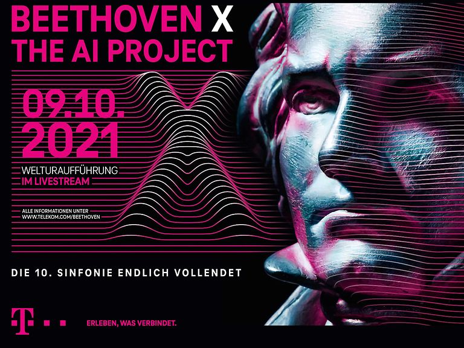

# Media and Industry

I'm available for media contact about all of the topics discussed on this site listed here.
I am most often asked for interviews on the subject of “AI composition”, and especially for insight into the “Beethoven X” project which attracted considerable media attention.

## Feature: 'Beethoven X' 

In 2019 Deutsche Telekom commissioned a group of us to create some kind of realisation of Beethoven's plans for a 10th symphony ... using AI.
'Beethoven X' (as it came be to known) was a fascinating project asking timely questions like:
- what AI can accomplish in terms of learning and imitating musical style,
- what kinds of human-computer interactions are possible and desirable.

### Official Links

- Deutsche Telekom's website in [English](https://www.telekom.com/en/company/topic-specials/beethoven-year-2020-special/beethoven-s-unfinished-symphony) and [German](https://www.telekom.com/de/konzern/themenspecials/special-250-jahre-beethoven/beethovens-unvollendete)

### Behind the scenes

For a look behind the scenes, check out the following:

- [a paper we wrote about the process](https://zenodo.org/record/7088335#.YyqWQi0RpQI)
- [short video to complement that paper (click here or on the image below)](https://www.youtube.com/watch?v=qCrksRVsffM)
- [transcriptions of all the available sketches](https://musescore.com/user/8641586/scores/8121744) including one that's effectively 'never before seen' (ID0).
- the numerous press interviews I and other members of the team gave (details on the request, but a quick internet search is probably effective!)

