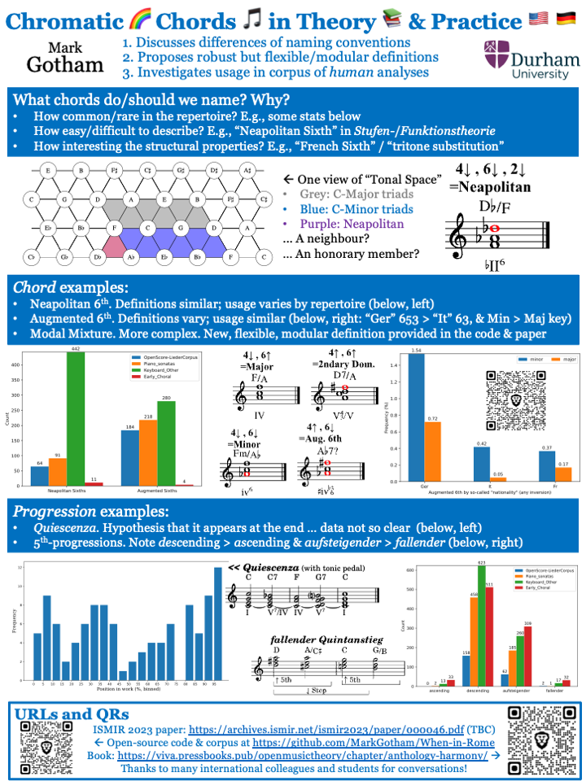
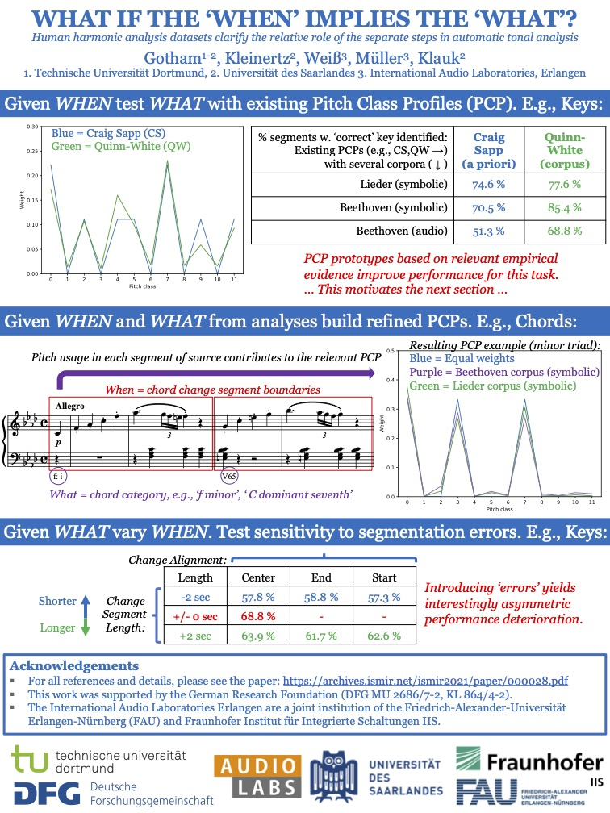

# Research

I work on music theory, analysis, and composition, almost (but not always) using computational methods of one kind of another.

On this page:

- [New/Featured](#feature)
- [All Publications](#publications)
- [Recent Invited Talks](#invited-talks)
- [Some Posters and Videos](#posters-and-videos)

## Feature

Much of the recent work centres on the creation, curation, and analysis of musical dataset, particularly human analyses in encoded formats.
For example, for harmonic analysis I've been curation the ["When in Rome"](https://github.com/MarkGotham/When-in-Rome) meta-corpus which and used that for ...

- research projects using that data for automatic harmonic analysis with machine learning.
	- See especially "Augmentednet" ([Paper](https://archives.ismir.net/ismir2021/paper/000050.pdf), [Poster](https://markgotham.github.io/images/augmentednet.pdf), [Video](https://youtu.be/tybUycbBHAA))
	- ... and before that ["Not all Roads lead to Rome"](https://transactions.ismir.net/articles/10.5334/tismir.45)
	- ... as well as related tasks studies like *What if the When implies the What?* ([Paper](https://archives.ismir.net/ismir2021/paper/000028.pdf), [Poster](https://markgotham.github.io/images/When_What_Poster.pdf), [Video](https://www.youtube.com/watch?v=iFjeorX6juo))
- research on that data *in itself* (*Chromatic chords in theory and practice*: [Paper](https://doi.org/10.5281/zenodo.10265275), [Poster](images/Chromatics.pdf), [ISMIR 2023 intro video](https://youtu.be/MKtW3d00a5g))
- pedagogical / public-facing anthology [as discussed here](https://emusicology.org/index.php/EMR/article/view/7644) and provided as part of the [Open Music Theory textbook here](https://viva.pressbooks.pub/openmusictheory/chapter/anthology-harmony/)

## Publications

Lists of indexed publications are available in all the usual places: publications are available in all the usual places:

- [ORCID](https://orcid.org/0000-0003-0722-3074) - partly curated by me,
- [Google Scholar](https://scholar.google.com/citations?view_op=list_works&hl=en&user=bA0PEo0AAAAJ) - automatic and probably the most complete among them,
- [Semantic Scholar](https://www.semanticscholar.org/author/Mark-R.-H.-Gotham/28367380) - automatic,
- [Web of Science](https://www.webofscience.com/wos/author/record/IUN-5075-2023) - automatic,
- [Zotero](https://www.zotero.org/markgotham#F5LMS8VP) - curated by me
- [DBLP](https://dblp.org/pid/208/1338.html) - only certain journals/conferences as it's a "computer science bibliography".

No need to repeat all of that content here!

## Invited Talks

Current/recent invited talks provide an indication of other groups working in related areas.
Thanks to all the collaborators and hosts involved!

- Coming soon in 2024:
	- Invited talk at & participation in [Dagstuhl Seminar 24302: Learning with Music Signals: Technology Meets Education.](https://www.dagstuhl.de/24302), DE
- 2023, Autumn: 
	- Invited talk at the [German national musicology conference (GfM)
](https://www.uni-saarland.de/fachrichtung/musikwissenschaft/gfm-tagung-2023/programm-gfm-tagung-2023.html), DE
	- University of Michigan, USA

- 2023, Spring:
	- Keynote @ the [10th International Conference on New Music Concepts (ICNMC 2023)](http://www.studiomusicatreviso.it/icnmc/icnmc.php), Treviso, IT
	- York University, UK
	- Eastman School of Music, U. of Rochester, NY, USA
- 2022, Autumn: 
	- Utrecht University, Department of Information and Computing Sciences, NL
	- University of Music and Performing Arts Vienna, AT
	- Anton Bruckner Privatuniversität Linz, AT
	- Université de Lille, FR
- 2022, Spring-Summer: 
	- Mutter-Beethoven-Haus, Koblenz: ‘Understanding Beethoven: Musicology and Computer Science in Dialogue’, DE
	- Technische Universität Dortmund: flagship ‚TU Dortmund im Gespräch‘ series, DE
	- [Trier Centre for Digital Humanities, DE](https://tcdh.uni-trier.de/), DE
- 2021 
	- Volkswagen (VW AG), Innovation Group, DE
	- University of Salzburg and Mozarteum University joint “Music & Math” seminar series, AT
	- Eastman School of Music, U. of Rochester, Workshop/talk on computation in music, NY, USA
- 2020 
	- Joint Statistical Meetings (JSM, the largest gathering of statisticians and data scientists held in North America): Part of a Topic Contributed Session (TCS) on statistics in music. Joint paper with Ahmed Elgammal; session organiser: Jan Beran, USA
	- [Karajan Music Tech Conference](https://www.karajanmusictech.com), AT

## Posters and Videos

[Some talks and related conference videos can be viewed on YouTube here](https://www.youtube.com/@markgotham8699).
Here are a few recent papers that come with posters and short video summaries:

Short Title & paper/poster link|Venue; Year|Video
:---:|:---:|:---:|:---:|:---:|
||
*Chromatic chords in theory and practice* [Paper](https://archives.ismir.net/ismir2023/paper/000046.pdf), [Poster](images/Chromatics.pdf)|[ISMIR; 2023](https://ismir2023program.ismir.net/poster_46.html)|
*Musical Micro-Timing for Live Coding* [Paper](https://archives.ismir.net/ismir2023/paper/000093.pdf), [Poster](images/Musical_Microtiming.pdf)|[ISMIR; 2023](https://ismir2023program.ismir.net/poster_93.html)|
*Musical Genre Recognition* [Paper](https://link.springer.com/chapter/10.1007/978-3-031-29956-8_27), [Poster](images/evomusart.pdf)|EvoMUSART; 2023|N/a
*What if the When implies the What?* [Paper](https://archives.ismir.net/ismir2021/paper/000028.pdf), [Poster](images/When_What_Poster.pdf)|ISMIR; 2021|
*Augmentednet* [Paper](https://archives.ismir.net/ismir2021/paper/000050.pdf) [Poster](images/augmentednet.pdf)|ISMIR; 2021|
*Discourse Not Dualism* [Paper](http://archives.ismir.net/ismir2020/paper/000058.pdf), [Poster](images/ISMIR2020.pdf), [& More](https://program.ismir2020.net/poster_2-05.html)|ISMIR; 2020|
